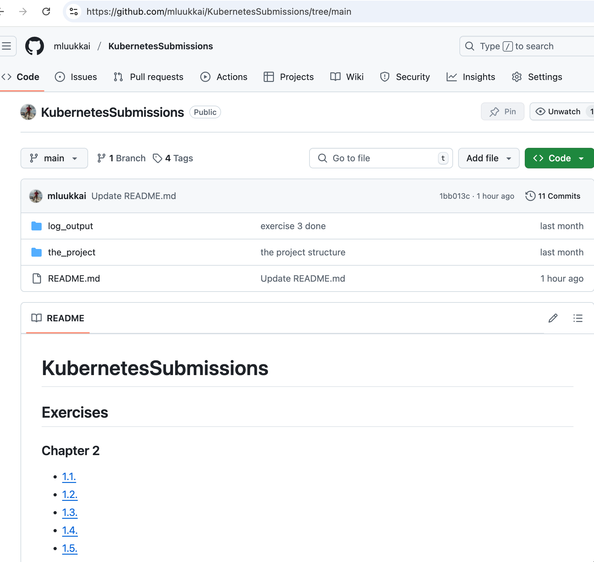
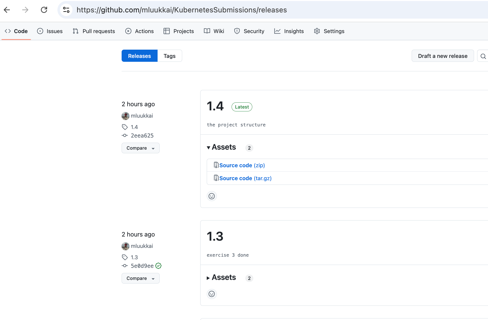
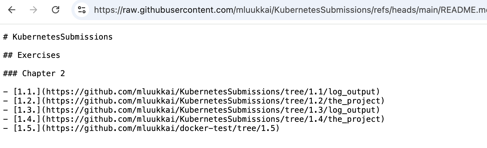
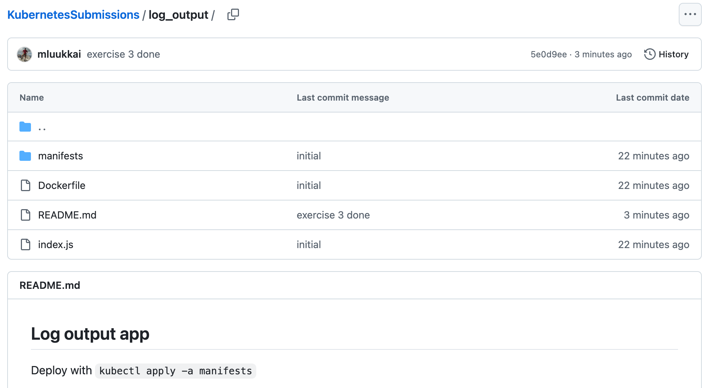

# Submitting exercises

During the course, you are building a set of apps and Kubernetes configs for those. You save all the apps and configs to one or several GitHub repositories.

One example to organize the repository is https://github.com/guidebee/KubernetesSubmissions that looks like this

This example shows one possible way to organize the repository: there is one directory per application.

After each exercise, you should make a GitHub release that has a tag that matches the exercise number. E.g., the example has the following releases:

The README.md file of the repository should include a link to the relevant app for each exercise, e.g., the link 1.1. points to log_output since that is the directory where the application of that exercise is stored. The link has to point to the corresponding release:

As can be seen, 1.1. is a link to the version of the correponding app in the release 1.1.

If you are using multiple repositories for exercises, your main repository should still have the links for each exercise. As you can see, in the above example, 1.5. is a link to another repository.

Besides all this, each of the applications should have a README.md that describes how the application is started up and other relevant info. The readme could look like the following

Make sure that the repository is available to GitHub user guidebee. We prefer public repositories, but if you want to keep your experience secret, you can create a private repository and add guidebee(opens in a new tab)(opens in a new tab) as a collaborator.

It is extremely important that you follow the above explained

- make a release for every exercise (with the same name as the exercise number)
- make a link from your main repository README.md to each exercise, the link points to the corresponding release and the directory that is relevant for the exercise
- repository should be accessible for GitHub user guidebee

In most of the exercise you are only asked to submit a link to the GitHub release corresponding to the exercise. Some of the exercises might ask you also to submit something more besides to the commit links.

The first and the last exercises of the course are special ones. In the first, it is checked that you have read this page and are safe to proceed with the course. The last exercise of the course is used to signal that you are done with the course.

Your exercises are reviewed when you submit the last exercise, and if everything is more or less ok, you will be graded and the cert and university credits are available to you.
